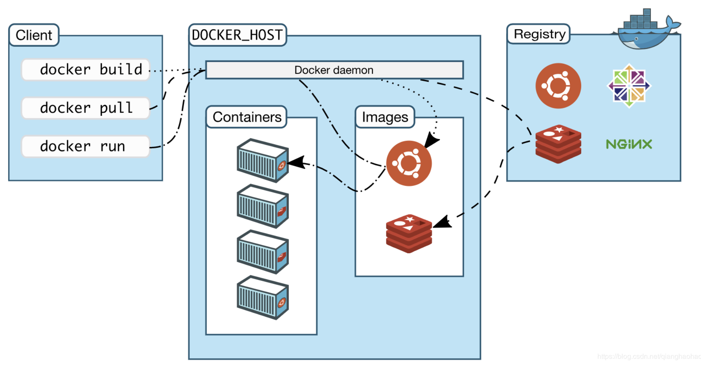
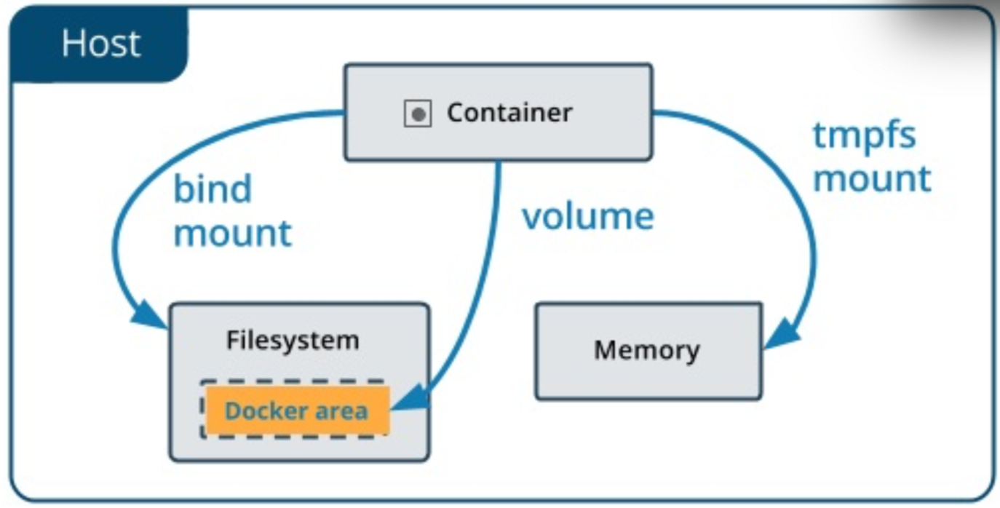

# docker pratice 学习笔记

## 1. 几个 docker 相关解释

**`docker run -it --rm ubuntu:16.04 bash`**

> -i: 交互式操作
>
> -t: 终端
>
> --rm 容器退出后随之将其删除
>
> ubuntu:16.04 镜像:tag
>
> bash 命令

**`docker system df`**

> 查看镜像、容器、数据卷所占用的空间

**`docker image ls -f dangling=true`**

> 显示虚悬镜像，同名pull或者build后被挤下为<none>的景象
> 可以用 `docker image prune`命令删除 dangling image

**`docker image ls -q`**

> 列出所有镜像 id

**分层存储**

> **Docker镜像**
>
> 操作系统分为*内核*和*用户空间*，对于 Linux 而言，内核启动后，会挂载 `root 文件系统`为其提供用户空间支持。Docker 镜像，就相当于是一个 `root 文件系统`，除了提供容器运行时所需的程序、库、资源、配置等文件外，还包含一些为运行时准备的配置参数（如 匿名卷、环境变量、用户等）。镜像不包含任何动态数据，其内容在构建后也不会被改变。
>
> **分层存储**
>
> 利用 Union FS 技术，Docker 设计为分层存储的架构。
>
> 镜像在构建时，会一层层构建，前一层是后一层的基础。每一层构建完就不会再发生改变，后一层的任何改变只发生在自己这一层。在构建镜像时，尽量只包含该层需要添加的东西，任何额外的东西应该在该层构建结束前清理掉。
>
> Union FS 是有最大层数限制的，比如 `AUFS`，目前是最大 `127` 层

## 2. 使用 docker commit 命令

> **手动给旧的镜像添加了新的一层，形成新的镜像**
>
> docker commit 可以在容器被入侵后后保存现场，定制镜像应该使用 Dockerfile 来完成，*慎用 docker commit*，因为这些操作是黑箱操作，除了制作的人知晓执行了什么命令，如何生成，别人无从知晓。

**step 1. `docker run --name webserver -d -p 80:80 nginx`**

> 启动一个容器，命令为 webserver，并且映射了 80 端口，然后用 http://localhost/ 来访问

**step 2. `docker exec -it webserver bash`**

> 进入容器，准备修改内容
> `echo '<h1>Hello, nginx; Hi, Docker!</h1>' > /usr/share/nginx/html/index.html`

**step 3. 保存镜像，即将容器的存储层保存下来，成为镜像**

```sh
docker commit \
--author "lpan@yoozoo.com" \
--message "修改了默认网页内容" \
webserver \
nginx:v2
```

> 用`docker history nginx:v2`来查看镜像内的历史记录

**step 4. 运行新的定制好的镜像**

```sh
docker run --name web2 -d -p 81:80 nginx:v2
```

## 3. 使用 Dockerfile 定制镜像

> Dockerfile 本身是一个文本文件，其内容包含了一条条指令，每一条指令构建一层。

**step 1. 新建目录，然后新建 Dockerfile 文件，内容如下：**

```dockerfile
FROM nginx
RUN echo '<h1>Hello, Docker!</h1>' > /usr/share/nginx/html/index.html
```

> `必须` **FROM** 指定基础镜像
>
> *服务类镜像*，如 `nginx`、`redis`、`mysql`、`httpd`、`php`、`tomcat`等；
>
> *构建、运行各种语言应用类镜像*，如`node`、`python`、`golang`等
>
> *还有更基础的操作系统镜像*，如 `ubuntu`、`debian`、`centos`等
>
> *空白镜像* ：`scratch`；
>
> 这意味着不以任何镜像为基础，接下来所写的指令将作为镜像的第一层开始存在。
>	​	
>  如 `swarm`、 `coreos/etcd`

> **RUN** 执行命令
>
> *shell 格式*： `RUN <命令>`
>
> *exec 格式*  `RUN ["可执行文件", "参数1", "参数2"]`

> - Dockerfile 支持 Shell 那样的行尾添加 `\` 来换行
>
> - 行首 `#` 用来注释
>
> - 每一层执行完要执行清理工作

**step 2 在 Dockerfile 文件所在目录执行命令**

```sh
docker build -t nginx:v3 .
#输出结果如下
Sending build context to Docker daemon  2.048kB
Step 1/2 : FROM nginx
 ---> f09fe80eb0e7
Step 2/2 : RUN echo '<h1>Hello, Docker!</h1>' > /usr/share/nginx/html/index.html
 ---> Running in 190ad3f8a2a4
Removing intermediate container 190ad3f8a2a4
 ---> 15ad186d2e09
Successfully built 15ad186d2e09
Successfully tagged nginx:v3

```

> 命令格式 
>
> `docker build [选项] <上下文路径>`
>
> 工作原理
>
> Docker 在运行时分为 Docker 引擎和客户端工具。
> ​	
> Docker 引擎提供了一组 REST API，被称为 Docker Remote API，而如 `docker`命，令这样的客户端工具，则是通过这组 API 与 Docker 引擎交互，来完成各种功能。因此，我们在本机上执行各种 `docker` 功能，实际上是**使用远程调用形式在服务端（Docker 引擎）完成**。


> ###上下文目录 理解

**对 Docker 构建上下文的理解误区**

> 构建步骤
> 1. 跳到 Dockerfile 所在目录
> 2. 执行 docker build 命令
`docker build -t <imageName:imageTag> .`

> 上面的命令的理解误区
>
> `误区1` `docker build` 后面的 `.` 为 Dockerfile 所在的目录
>
> `误区2` Dockerfile 文件名不能更改

**docker build 构建镜像的流程大致如下**

> 1. 执行 `docker build -t <imageName:imageTag> .`
> 2. Docker 客户端会将构建命令后面指定的路径(`.`)下的所有文件打包成一个 tar 包，发送给 Docker 服务端
> 3. Docker 服务端收到客户端发送的 tar 包，然后解压，根据 Dockerfile 里面的指令进行镜像的分层构建



**关于 `docker build` 指令的几点重要的说明**

> 1. 如果构建镜像时没有明确指定 Dockerfile，那么 Docker 客户端默认在构建镜像时指定的上下文路径下找名字为 Dockefile 的构建文件
> 2. 可以通过 `-f`指定构建文件，名称可以任意命令
> 3. **Dockerfile 中指令的工作目录是服务器解压客户端传输的 tar 包的路径**


> ### 其他命令

> **COPY** 复制文件 格式如下
> ​	
> `COPY  <源路径> ... <目标路径>`
> ​	
> `COPY ["<源路径1>", ... "<目标路径>"]`
> ​	
> **ADD** 更高级的复制文件，格式和性质与 **COPY **基本一致。
> ​	
> **ADD** 的源路径可以是 URL，可以是压缩包。*Dockerfile 最佳实践文档* 推荐尽量使用 COPY。


**`docker save myweb:v4 | gzip > myweb-v4.tar.gz`**

> 保存myweb:v4这个镜像

**`docker load -i myweb-v4.tar.gz`**

> 加载镜像 myweb-v4

## 4. `docker run` 做了哪些事

> 1.  检查本地是否存在制定的镜像，不存在就从公有仓库下载
> 2.  利用镜像创建并启动一个容器
> 3.  分配一个文件系统，并在只读的镜像层外面挂载一层可读写层
> 4.  从宿主主机配置的网桥接口中桥接一个虚拟接口到容器中去
> 5.  从地址池配置一个 ip 地址给容器
> 6.  执行用户指定的应用程序
> 7.  执行完毕后容器被终止

**`docker start` **

> 直接将一个已经终止的容器启动运行

> 容器的核心为所执行的应用程序，所需要的资源都是应用程序运行所必需的。除此之外，并没有其他的资源。可以在伪终端中利用 `ps 和` `top` 来查看进程信息。
>
> *容器中仅运行了指定的 bash 应用，这样使得 Docker 对资源的利用率极高，是货真价实的轻量级虚拟化。*

**后台运行（守护态运行）**

> **docker run 带 -d 参数 ** 后台运行，然后使用 `docker exec <容器id>` 进入

**清理所有处于终止状态的容器**

> `docker container prune`

## 5. docker search

> `docker search centos`
>
> 查找官方仓库中的镜像

## 6. Docker 数据管理



**数据卷（Volumes**）

> 1. `数据卷`可以在容器之间共享和重用
> 2. 对`数据卷`的修改会立马生效
> 3. 对`数据卷`的更新，不会影响镜像
> 4. `数据卷`默认会一直存在，即使容器被删除

> **case 1 创建一个数据卷**
>
> ` docker volume create my-vol`
>
> **case 2 查看所有数据卷**
>
> `docker volume ls`
>
> **case 3 查看指定数据卷的信息**
>
> `docker volume inspect my-vol`
>
> **case 4 查看数据卷的具体信息**
>
> `docker inpect web` #数据卷信息在 ”Mounts“ 里

**挂载主机目录（Bind mounts）**

> `docker run --name myweb3 -d -p 81:80  --mount source=my-vol,target=/usr/share/nginx/html nginx:v2`
>
> 上面的命令是，加载`数据卷` my-vol 到目标目录 target后面的
>
> `docker run --name myweb3 -d -p 81:80  --mount source=/var/foo/bar,target=/usr/share/nginx/html nginx:v2`
>
> 上面的命令是，加载主机的 /var/foo/bar 目录到容器的 target后面的目录。

## 7. Docker 中的网络功能介绍

> Docker 允许通过外部访问容器或者容器互联的方式来提供网络服务

**外部访问容器**

> **-P**(大写) Docker 会随机映射一个端口到内部容器开放的网络端口。
>
> *demo*
>
> **step1**`docker run -d -P training/webapp python app.py`
>
> **step2** `docker ps -l`
>
> **step3** `docker logs -f <container name>`命令查看应用的信息


> **-p**（小写）指定要映射的端口，并且，在一个指定端口上只可以绑定一个容器。支持的格式有
>
> ​	`ip:hostPort:containerPort | ip::containerPort | hostPort:containerPort`
>
> demo
>
> **case 1 映射所有接口地址** 使用 `hostPort:containerPort`
>
> `docker run -d -p 5000:5000 training/webapp python app.py`
>
> **case 2 映射到指定地址的指定端口** 使用 `ip:hostPort:containerPort`格式指定映射使用一个特定地址
>
> `docker run -d -p 127.0.0.1:5000:5000 training/webapp python app.py`
>
> **case 3 映射到指定地址的任意端口** 使用 `ip:containerPort` 绑定 localhost 的任意端口到容器的 5000 端口，本地主机会自动分配一个端口。
>
> `docker run -d -p 127.0.0.1::5000 training/webapp python app.py`
>
> 还可以使用 udp 标记来指定 udp 端口
>
> `docker run -d -p 127.0.0.1:5000:5000/udp training/webapp python app.py`

**查看映射端口配置**

```sh
docker port <container name> 5000
```

> ####注意
>
> * 容器有自己的内部网络和 ip 地址（使用 docker inspect 可以获取所有的变量）
>
> * `-p`标记可以多次使用来绑定多个端口
>
>   ```sh
>   docker run -d \
>   	-p 5000:5000 \
>   	-p 3000:80 \
>   	training/webapp \
>   	python app.py
>   ```

**容器互联**

> #### 新建网络
>
> `docker network create -d bridge my-net`
>
> `-d` 参数指定 Docker 网络类型，有`bridge` `overlay`。其中 `overlay` 网络类型用于 Swarm mode，暂忽略。
>
> #### 连接容器
>
> `docker run -it --rm --name busybox1 --network my-net busybox sh`
>
> 运行一个容器并连接到新建的 `my-net` 网络
>
> 再运行一个容器并加入到 `my-net` 网络
>
> `docker run -it --rm --name busybox2 --network my-net busybox sh`
>
> #### 测试连通性
>
> 在 `busybox1` 输入以下命令
>
> `ping busybox2`
>
> 同理在 `busybox2` 中`ping busybox1`

## 8. Docker Compose 项目

> *`Compose` 项目是 Docker 官方的开源项目，项目由 Python 编写，实现上调用了 Docker 服务提供的 API 来对容器进行管理。负责实现对 Docker 容器集群的快速编排。*
>
> 项目地址：`https://github.com/docker/compose`
>
> `Compose` 允许用户通过一个单独的 `docker-compose.yml` 模版文件（YAML格式）来定义一组相关联的应用容器为一个项目（project）


> *`Compose` 中有两个重要的概念*
>
> * 服务（`service`）：一个应用的容器，实际上可以包括若干运行相同镜像的容器实例。
> * 项目（`project`）：由一组关联的应用容器组成的一个完整业务单元，在 `docker-compose.yml` 文件中定义。

**`docker-compose --version`**

> 查看 docker compose 版本信息
>
> 结果如下：
>
> ```sh
> docker-compose version 1.23.2, build 1110ad01
> ```

**`docker-compose version`**

> 查看 compose 相关版本信息
>
> 结果如下：
>
> ```
> docker-compose version 1.23.2, build 1110ad01
> docker-py version: 3.6.0
> CPython version: 3.6.6
> OpenSSL version: OpenSSL 1.1.0h  27 Mar 2018
> ```

**Compose 模板文件** 

> demo 如下

```yaml
version: "3"

services:
    webapp:
        image: examples/web
        ports:
            - "80:80"
        volumes:
            - "/data"
```

（以上）